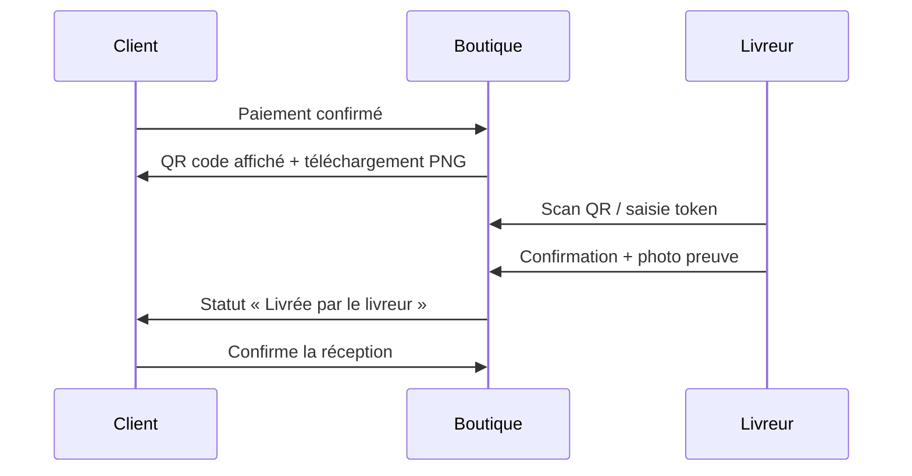

# Livraison & espace livreur

## Parcours client (QR code)

1. Après paiement réussi, un **QR code visuel** s'affiche (page résultat + détail commande).
2. Le client peut **télécharger** le PNG (`qr-KL-XXXX.png`).
3. Le QR encode le **token secret** scanné par le livreur.

## Parcours livreur

### 1. Obtenir une course

| Méthode | Qui | Comment |
|---------|-----|---------|
| **Admin Filament** | Administrateur | Ventes → Livraisons → assigner un livreur |
| **Self-service** | Livreur | `/livreur` → onglet **Disponibles** → « Prendre en charge » |

Quand une commande **physique** est payée, une livraison `pending` est créée automatiquement.

### 2. Espace livreur (`/livreur`)

Compte : `livreur@kenluamba.com` (rôle `courier`)

| Onglet | Contenu |
|--------|---------|
| **Mes courses** | Livraisons assignées au livreur (en cours) |
| **Disponibles** | Courses sans livreur — bouton « Prendre en charge » |
| **Scanner QR** | Vérifier le QR client, confirmer avec photo |

### 3. Livraison jusqu'à confirmation

1. **Payée** → livraison créée (`pending`)
2. **Assignée** → livreur pris en charge (`assigned`, commande `out_for_delivery`)
3. **Sur place** → scan du QR client
4. **Photo preuve** → obligatoire pour livraison à domicile, recommandée pour retrait
5. **Confirmée** → commande `delivered_by_courier`
6. **Client** → confirme réception dans `/espace/commandes/{n}` → `completed`

## API livreur

| Méthode | Endpoint | Rôle |
|---------|----------|------|
| GET | `/courier/deliveries` | `mine` + `available` |
| POST | `/courier/deliveries/{id}/accept` | Prendre une course |
| POST | `/courier/scan` | Vérifier token QR |
| POST | `/courier/confirm` | Confirmer (multipart + photo) |

## Admin Filament

**Ventes → Livraisons** : assigner un livreur, puis bouton **« Maintenant »** ou **« Assigner maintenant »** pour fixer la date d'assignation. La date de livraison est remplie par le livreur via QR.

## Fichiers clés

| Zone | Fichier |
|------|---------|
| QR client | `frontend/src/components/orders/OrderQrCode.tsx` |
| Espace livreur | `frontend/src/app/livreur/page.tsx` |
| Service | `backend/app/Services/DeliveryService.php` |
| API | `backend/app/Http/Controllers/Api/V1/CourierController.php` |
